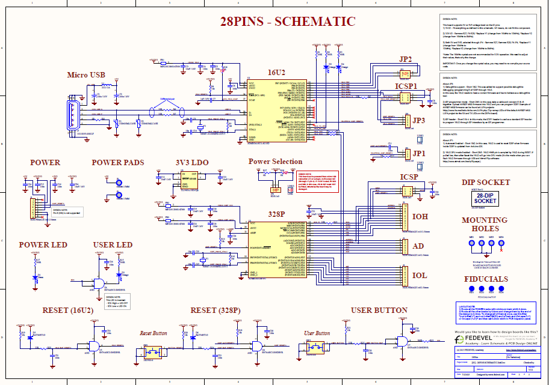
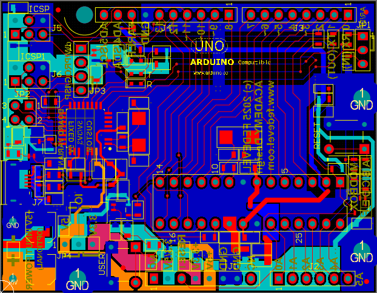
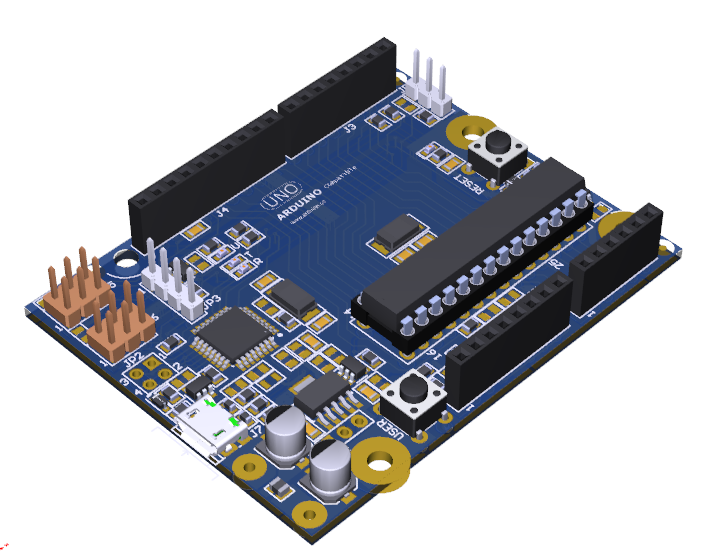

# Arduino Uno Rev3 based PCB Design (Altium Designer)

  <!-- Optional image of your PCB layout -->

## Description
This repository contains a complete **Arduino Uno Rev3 PCB design** based on the reference design from **Fedevel Academy**. It includes the full **schematic**, **PCB layout**, **assembly files**, **BOM (Bill of Materials)**, and **3D views**.

The goal of this project is to provide a **custom PCB design** that replicates the Arduino Uno Rev3 form factor and features, while offering a more professional approach to designing Arduino-based boards.

## Features
- Fully compatible with **Arduino Uno Rev3**
- Designed using **Altium Designer**
- Includes **3D view** of the PCB layout
- Detailed **schematic diagram** of the design
- Complete **Bill of Materials (BOM)**
- Ready-to-use **assembly files** for manufacturing

## Project Files
The following files are included in this repository:

- **Schematic**: Detailed circuit diagram in `.SchDoc` format
- **PCB Layout**: Fully routed PCB design in `.PcbDoc` format
- **Assembly Files**: Includes gerber files for manufacturing
- **BOM**: Complete Bill of Materials for easy component sourcing
- **3D View**: A 3D rendering of the PCB layout for visual inspection

### File Structure:
- `schematic/`: Contains the schematic design file (`.SchDoc`)
- `Assembly and 3D Models/`: Gerber files for PCB manufacturing , Bill of Materials and 3D render images of the PCB

### Schematic Diagram

  

### PCB Layout

  <!-- Image of PCB layout preview -->

### 3D View of the PCB

 

## Build Instructions

### Step 1: Manufacturing the PCB
1. Download the **Gerber files** from the `assembly/` folder.
2. Use these files to send to your preferred PCB manufacturer.

### Step 2: Assembling the Components
1. Once you have the PCB, begin the assembly by following the **Bill of Materials (BOM)**.
2. Solder the components according to the **schematic** and **PCB layout**.
3. Ensure all connections are made correctly, especially power and ground connections.

### Step 3: Testing the Board
Once the board is assembled:
1. Connect it to a computer or USB power supply.
2. Load the standard **Arduino Uno sketch** onto the board to verify that it functions correctly.

